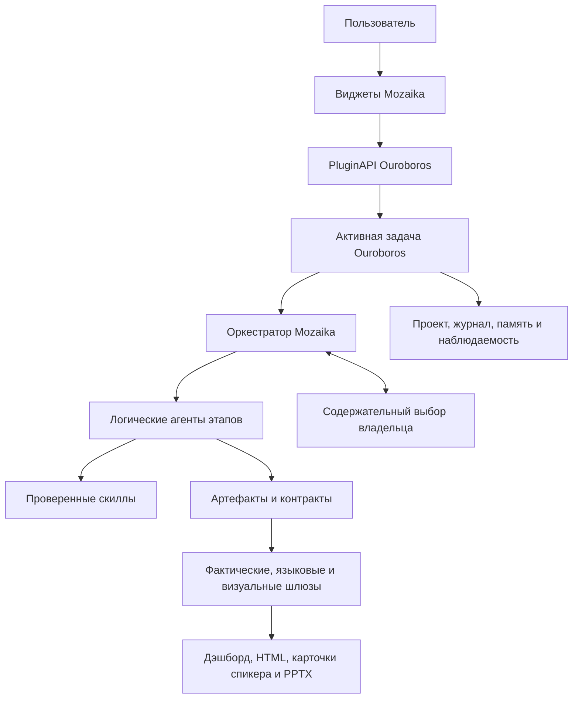
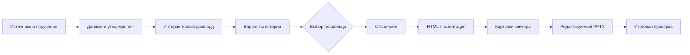
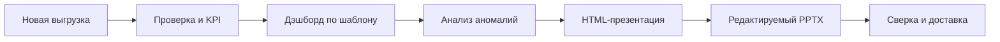

# Архитектура Mozaika

Версия документа: 2.0
Дата проверки: 18 июля 2026 года
Ouroboros: `6.71.0`, коммит `50756ed`
Mozaika: `1.4.4`

## 1. Назначение

Mozaika — предметное расширение Ouroboros для подготовки управленческой аналитики. Оно принимает неоднородные источники, организует многоэтапную работу логических агентов, сохраняет происхождение выводов и выпускает несколько согласованных пользовательских артефактов.

Архитектура оптимизирует баланс между автономностью и контролем:

- обратимые технические решения агент принимает самостоятельно;
- существенные изменения данных выполняет с уведомлением и сохранением исходников;
- выбор, меняющий управленческий смысл, передаётся владельцу одним ограниченным вопросом.

Это обзор системы. Подробное соответствие MVP, результаты тестов и сценарии вынесены в отдельные документы, чтобы архитектура оставалась читаемой.

## 2. Граница системы

Mozaika состоит из предметного слоя поверх ГигаАгента Ouroboros.

| Слой | Ответственность |
|---|---|
| Ouroboros | Настольное приложение, сервер, очередь и жизненный цикл задач, агентный цикл, модели, инструменты, проекты, память, контекст, ревью, скиллы, безопасность и наблюдаемость |
| Mozaika | Два пользовательских входа, сценарии, агентные роли, контракты передачи, правила решений, брендбук и предметные проверки аналитических артефактов |
| Подключаемые скиллы | Анализ данных, SQL, визуализация, сторителлинг, HTML и PPTX |
| Пользователь | Цель, источники, предметные ограничения и единственный содержательный выбор в исследовательском сценарии |

Mozaika не содержит собственной очереди, скрытого фонового конвейера, отдельной системы памяти или механизма самоизменения. Эти функции принадлежат Ouroboros.



## 3. Интеграция с Ouroboros

Главный пакет находится в `skills/mozaika/` и объявлен как extension-скилл:

- версия: `1.4.4`;
- среда: `python3`;
- точка входа: `plugin.py`;
- `PluginAPI 1.3`;
- разрешения: `net`, `fs`, `subprocess`, `route`, `widget`, `inject_chat`, `tool`.

Расширение регистрирует:

- инструменты `validate_gate` и `request_owner_choice`;
- восемь маршрутов в пространстве `/api/extensions/mozaika/...`;
- две вкладки страницы виджетов: `Mozaika · Инсайты` и `Mozaika · Рутинный отчёт`.

Стартовый HTTP-маршрут не анализирует данные. Он:

1. проверяет вход;
2. создаёт изолированный `launch_id` и каталог запуска;
3. сохраняет загруженные файлы или регистрирует подтверждённые локальные пути;
4. создаёт `assignment.md` и `launch-manifest.json`;
5. вычисляет SHA-256 задания;
6. через Host Service помещает короткую команду в основной чат Ouroboros.

Дальнейшая работа выполняется в видимой активной задаче. Поэтому пользователь видит ход кампании, может сделать выбор и получает стандартный результат Ouroboros.

Подробнее: [интеграция с Ouroboros](docs/OUROBOROS_INTEGRATION.md).

## 4. Пользовательский вход и данные

Оба виджета принимают единый упорядоченный список из:

- URL;
- отдельных файлов;
- папок;
- файлов и папок, добавленных перетаскиванием.

Системный диалог возвращает подтверждённый владельцем абсолютный путь без чтения файла в память браузера. На этапе данных источник копируется потоково в каталог кампании, после чего проверяются размер и SHA-256. Исходный файл не изменяется и не удаляется.

Перетаскиваемые браузерные файлы сохраняются как входные артефакты с относительными путями. URL валидируются и остаются явными источниками. Ссылка на коллекцию не считается полной областью, пока агент не перечислит её дочерние элементы.

Большие данные не помещаются в контекст модели: между этапами передаются пути, агрегаты, хэши и ссылки на зарегистрированные артефакты.

## 5. Сценарии

### 5.1. Поиск инсайтов — `insight_deck`



Владелец выбирает не внешний вид, а управленческую стратегию рассказа. Дэшборд и карточки вариантов являются отдельными HTML-поверхностями. После выбора создаётся неизменяемая карточка принятой стратегии; сторилайн строится до презентации, а карточки спикера — после принятой презентации, по одной на каждый слайд.

### 5.2. Регулярный отчёт — `weekly_autopilot`



Это второй виджет: известный процесс, утверждённый шаблон, новые данные. Карточек выбора и сторилайна нет. Агент пересчитывает KPI, сравнивает отклонения с историей, целями и сопоставимыми группами и выпускает материалы по фиксированной логике.

### 5.3. Внутренний контракт — `routine_report`

Сохранён переиспользуемый маршрут `data → dashboard → presentation → pptx`. Он не вызывается второй карточкой и не содержит отдельного агента аномалий.

Точные этапы и артефакты: [сценарии](docs/SCENARIOS.md).

## 6. Агентная модель

Роли Mozaika — независимые логические владельцы этапов и контрактов. Это не девять постоянно работающих процессов. Текущая конфигурация использует `transport=local_task_skill`: родительская задача Ouroboros владеет вызовами скиллов, изменениями состояния и итоговым решением.

| Роль | Идентификатор | Ответственность |
|---|---|---|
| Данные | `mozaika-data-agent` | Инвентаризация, профилирование, обратимая очистка, расчёты и доказательства |
| Дэшборд | `mozaika-dashboard-agent` | Интерактивные диаграммы, таблицы, фильтры и варианты истории |
| Аномалии | `mozaika-anomaly-analysis-agent` | История, цели, сопоставимые группы и ранжирование отклонений |
| Сторилайн | `mozaika-storyline-agent` | Логика «мысль → доказательство → следствие → действие» |
| HTML-презентация | `mozaika-presentation-agent` | Богатая автономная презентация по принятой структуре |
| Карточки спикера | `mozaika-speaker-cards-agent` | Подсказка для каждого финального слайда |
| PPTX | `mozaika-pptx-agent` | Нативно редактируемая презентация и рендер слайдов |
| Деловой язык | `mozaika-business-language-validator-agent` | Отбраковка только явных критических текстовых сбоев |
| Визуальная проверка | `mozaika-visual-validator-agent` | Геометрия, адаптивность и интерактивные состояния реального рендера |

Агент определяет ответственность, скилл — способ выполнения. Связь «одна роль = один жёстко заданный скилл» намеренно отсутствует.

Точные идентификаторы, модельные профили и выходные контракты всех ролей приведены в [техническом справочнике](docs/IMPLEMENTATION_REFERENCE.md#6-роли).

## 7. Выбор скиллов

Перед каждым этапом оркестратор повторно оценивает доступные кандидаты и сохраняет решение `mozaika-skill-selection/v1`.

Приоритет:

1. явно назначенный владельцем установленный и прошедший ревью скилл;
2. установленный подходящий `anthropic-*`;
3. другой установленный скилл с актуальным ревью;
4. официальный обнаруживаемый Anthropic-скилл;
5. официальный скилл OuroborosHub;
6. другой проверенный кандидат.

Оцениваются соответствие контракту этапа, ожидаемое качество, сила проверки, происхождение, совместимость среды, свежесть ревью и стоимость зависимостей. Постоянная установка нового скилла требует одобрения владельца и штатного жизненного цикла Ouroboros.

Для HTML приоритетный кандидат — `html-presentation-studio`. Для финального PPTX владелец зафиксировал `presentation-skill`. `anthropic-pptx` хранится в репозитории, но исключён из рабочего пула Mozaika.

## 8. Контракты и передача состояния

В `skills/mozaika/contracts/` находятся 23 JSON Schema. Они образуют четыре группы:

| Группа | Примеры |
|---|---|
| Вход и область | `input-sources`, `research-brief`, `scope-ledger`, `owner-domain-profile` |
| Доказательства | `claim-registry`, `requirement-claim-map`, `handoff-envelope`, `artifact-index` |
| Нарратив и дизайн | `dashboard-spec`, `owner-choice`, `presentation-outline`, `speaker-story-cards`, `design-receipt` |
| Контроль | `business-language-audit`, `visual-layout-audit`, `narrative-integrity-audit`, `completion-gate` |

Передача между ролями содержит ссылки на неизменяемые артефакты и SHA-256, а не копии больших файлов. Следующий этап не должен начинаться без полного входного пакета.

### Сохранение пользовательской повестки

Каноническое инструкционное правило находится в `skills/mozaika/references/user-agenda-coverage.md`. Для `insight_deck` исходный `assignment.md`, неизменяемый `research-brief.json` и текущий `requirement-claim-map.json` образуют цепочку происхождения требований. Каждая принимающая роль должна заново прочитать исходное поручение, получить эту цепочку через handoff, отметить каждый пункт как `answered`, `partial`, `unanswered` или `not_applicable` и передать обновлённое покрытие следующей роли.

Сейчас это инструкционный chain-of-custody: схемы и шлюзы умеют проверять переданные данные, но `handoff-envelope.schema.json` ещё не делает отдельный coverage-паспорт обязательным полем. Поэтому пропуск оркестратором остаётся известной границей MVP; следующий уровень усиления — структурно обязательный паспорт покрытия и исполняемая блокировка следующего этапа при его отсутствии.

### Уровни контроля

Важно различать:

- **детерминированные проверки** в `plugin.py`: `validate_gate` пересчитывает ограничения переданного payload и не доверяет текстовому утверждению агента;
- **JSON Schema**: проверяют структуру сохраняемых контрактов;
- **инструкционные правила** в `SKILL.md` и `references/`: требуют от оркестратора создать контракт и вызвать нужный шлюз;
- **проверка реальной поверхности**: браузерный рендер HTML и рендер каждого слайда PPTX.

Детерминированный шлюз не читает файлы самостоятельно. Родительская задача обязана отдельно проверить существование артефакта, актуальность хэша, готовность выбранного скилла и визуальный результат. Последний QA показал, что пропуск обязательного шлюза остаётся возможным поведением модели; это текущая граница MVP, а не полностью закрытая проблема.

## 9. Контролируемая автономность

| Класс | Поведение | Примеры |
|---|---|---|
| Выполнить молча | Обратимое действие без изменения смысла | форматирование, чтение утверждённого брендбука, разрешение известного пути |
| Выполнить и уведомить | Существенная, но обратимая обработка с одной безопасной трактовкой | исключение выброса с сохранением исходника, исправление известного дрейфа схемы |
| Запросить выбор | Альтернативы меняют вывод, рекомендацию, риск или полномочия | разные группировки инсайтов, конфликт источников, новое внешнее действие |

Вопрос владельцу создаётся через `request_owner_choice`. Запрос хранится по `question_id`, появляется в первом виджете как кликабельные карточки и возвращается в тот же tool call. Если ожидание истекло, состояние сохраняется; агент не имеет права угадывать выбор.

## 10. Артефакты и политика сохранения

Применяется неизменяемое накопление:

- входы, этапные результаты и пользовательские артефакты не перезаписываются и не удаляются;
- исправление создаёт новую версию с новым идентификатором и хэшем;
- большие источники передаются по пути и хэшу;
- служебные JSON-контракты не должны попадать в пользовательские HTML;
- карточки вариантов истории не могут быть частью дэшборда;
- выбранная карточка стратегии не заменяет финальную колоду карточек спикера.

Брендбук в `brandbook/` содержит токены, манифест, шаблоны и референсы. Приоритет дизайна: явное указание владельца → брендбук Mozaika → встроенная тема генератора. Каждый визуальный этап должен сохранить квитанцию с хэшем манифеста.

## 11. Качество и наблюдаемость

Контур качества включает:

- происхождение KPI и материальных утверждений;
- покрытие каждого пункта пользовательского задания по `skills/mozaika/references/user-agenda-coverage.md`;
- целостность интерактивности дэшборда: каждый вариант фильтра обеспечен данными, выбранное значение участвует в пересчёте, все targets обновляются согласованно, декоративные контролы запрещены;
- целостность выбранной истории;
- критическую проверку делового языка с сохранением формулировок владельца;
- браузерную проверку широкого, среднего и узкого окна;
- рендер и визуальную проверку каждого слайда PPTX;
- итоговый completion gate.

Ouroboros ведёт журналы задач, инструментов, стоимости и результатов. Mozaika добавляет предметные квитанции: выбор скилла, область источников, реестр утверждений, решение владельца, применение брендбука и результаты проверок.

## 12. Безопасность и надёжность

- расширение работает только через разрешённый `PluginAPI`;
- iframe виджета изолирован от привилегий основной страницы;
- локальные пути проходят проверку и создаются только после явного выбора владельца;
- загруженные документы рассматриваются как данные, а не исполняемый код;
- секреты не передаются скиллам автоматически;
- новый скилл проходит предварительную проверку, ревью, разрешения и включение;
- исходные файлы сохраняются;
- повтор начинается с последней доказанной контрольной точки.

Для DeepSeek действует узкий резервный режим только для ошибки `Thinking mode does not support this tool_choice`: один повтор через обычный JSON и детерминированную проверку. Другие модели работают по штатному протоколу.

## 13. A2A и расширяемость

A2A-контракт спроектирован, но `a2a.enabled=false`. Разрешённый список адресов пуст, все роли локальные. Причины:

- нет проверенного удалённого узла;
- текущий текстовый транспорт недостаточен для больших артефактов;
- нужны исполняемые ограничения URL и перенаправлений;
- необходимы отдельные учётные данные и модель доверия.

Поэтому A2A является точкой развития, но не заявленной возможностью текущего MVP.

## 14. Развёртывание

Источник правды разработки:

- `skills/mozaika/` — расширение;
- `skills/*` — поставляемый пул скиллов;
- `brandbook/` — дизайн-система;
- `tests/` — проверки.

Рабочая среда Ouroboros:

- `data/skills/external/<name>` — установленный пакет;
- `data/state/skills/<name>` — рабочее состояние;
- `data/brandbook/mozaika` — рабочий брендбук.

После копирования скилл проходит штатный жизненный цикл. Пакет и состояние нельзя объединять. На момент проверки код Mozaika и конфигурация пула совпадают с рабочей копией, но проектный и рабочий брендбук различаются одной обновлённой PPTX-ссылкой и её SHA-256; перед демонстрацией требуется синхронизация.

## 15. Проверка реализации

Текущий автоматический набор:

```text
36 passed, 112 subtests passed
```

Проверены регистрация расширения, маршруты, два виджета, смешанные источники, безопасность URL и путей, неизменяемость запуска, выбор владельца, область данных, утверждения, карточки, брендбук, структура презентации и completion gate.


## 16. Карта исходников

### Mozaika

- `skills/mozaika/SKILL.md` — правила оркестратора;
- `skills/mozaika/plugin.py` — маршруты, инструменты и детерминированные шлюзы;
- `skills/mozaika/insight-widget.js`, `routine-widget.js` — интерфейс;
- `skills/mozaika/config/agent-pool.example.json` — роли и конвейеры;
- `skills/mozaika/contracts/` — 23 схемы;
- `skills/mozaika/references/` — предметные правила, включая `user-agenda-coverage.md` для сохранения пользовательской повестки;
- `brandbook/` — дизайн-система;
- `tests/` — автоматические проверки.

### Ouroboros

- `docs/ARCHITECTURE.md` — каноническая архитектура платформы;
- `ouroboros/contracts/plugin_api.py`, `extension_loader.py` — ABI расширений;
- `ouroboros/agent_task_pipeline.py`, `loop.py`, `outcomes.py` — выполнение и результат;
- `ouroboros/context_compaction.py` — управление контекстом;
- `ouroboros/skill_loader.py`, `skill_readiness.py`, `skill_review.py`, `tools/skill_exec.py` — загрузка, готовность и жизненный цикл скиллов;
- `ouroboros/projects_registry.py`, `ouroboros/project_facts.py`, `ouroboros/tools/project_journal.py`, `ouroboros/task_tree_ledger.py` — проекты и координация;
- `ouroboros/artifacts.py`, `observability.py` — артефакты и трассировка;
- `supervisor/` — очередь и рабочие процессы.

## 17. Инварианты

1. Первый виджет — поиск инсайтов, второй — регулярный отчёт.
2. Карточки выбора никогда не входят в дэшборд.
3. В `insight_deck` сторилайн создаётся только после выбора и до презентации.
4. Каждый явно заданный вопрос должен получить ответ либо видимый статус `partial`/`unanswered`.
5. Исходные данные и этапные артефакты сохраняются.
6. Брендбук имеет приоритет над темой генератора.
7. Финальный PPTX создаёт `presentation-skill` последним этапом.
8. `solved` требует актуальных доказательств и обязательных шлюзов.
9. Новый внешний скилл требует штатного ревью и разрешения владельца.
10. A2A не используется до явного включения и проверки безопасности.

## 18. Дополнительные материалы

- [Технический справочник](docs/IMPLEMENTATION_REFERENCE.md)
- [Архитектурные решения](docs/DESIGN_DECISIONS.md)
- [Сценарии](docs/SCENARIOS.md)
- [Интеграция с Ouroboros](docs/OUROBOROS_INTEGRATION.md)
