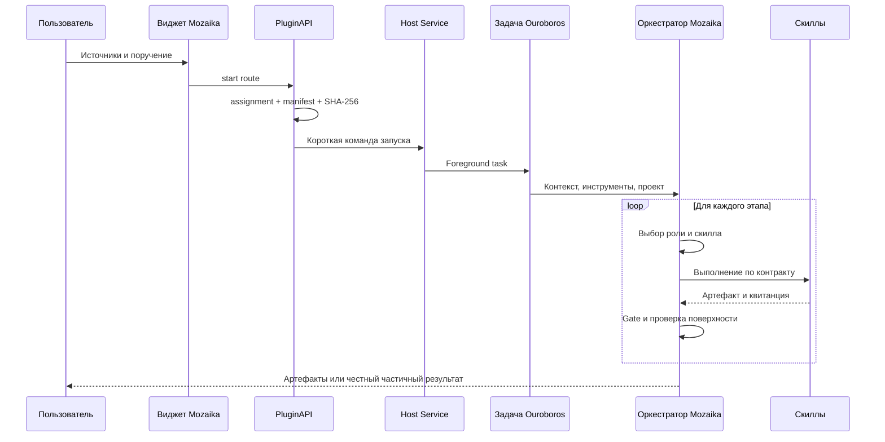

# Роль ГигаАгента Ouroboros в Mozaika

## 1. Почему это не просто набор скриптов

Mozaika описывает предметный способ подготовки аналитики, но не реализует собственную агентную платформу. Ключевой функционал выполняет ГигаАгент Ouroboros: он превращает поручение из виджета в длительную наблюдаемую задачу, даёт модели инструменты и скиллы, сохраняет состояние, проводит ревью и возвращает проверяемый результат.

Без Ouroboros оставались бы только форма загрузки и отдельные генераторы. Для воспроизведения текущего поведения пришлось бы заново реализовать очередь, жизненный цикл, проекты, память, контекст, модель полномочий, установку и ревью скиллов, наблюдаемость, восстановление и пользовательский выбор. Это сделало бы MVP существенно сложнее и менее надёжным.

## 2. Какие возможности используются

| Возможность Ouroboros | Использование Mozaika | Почему критично |
|---|---|---|
| Активные задачи | Вся аналитическая кампания выполняется как foreground task | Пользователь видит ход работы, ошибки и результат |
| Проекты и workpad | Хранят конфигурацию пула, решения и подтверждённые предпочтения | Повторный отчёт продолжает согласованный процесс |
| Агентный цикл | Модель выбирает инструменты, наблюдает результат и пересматривает план | Конвейер адаптируется к источникам и сбоям |
| Контекст и compaction | Старые технические раунды сворачиваются, критические факты сохраняются | Большая кампания не обязана держать историю целиком в prompt |
| Делегирование | Независимые проверки и рассуждения можно передавать ограниченным подзадачам | Параллелизм не меняет владельца результата |
| Жизненный цикл скиллов | Обнаружение, preflight, ревью, разрешения, включение и выполнение | Mozaika может выбирать инструменты динамически и безопасно |
| PluginAPI | Маршруты, виджеты, инструменты и возврат выбора владельца | Mozaika встроена в интерфейс, а не запускается сторонним скриптом |
| Безопасность | Политика инструментов, защищённые пути, режимы среды и разрешения | Автономность не означает неограниченный доступ |
| Ревью и outcomes | `solved`, `best_effort`, `blocked_with_evidence`, task acceptance | Частичный результат отделён от проверенного завершения |
| Артефакты и наблюдаемость | Task results, tool traces, стоимость, квитанции и хэши | QA может восстановить происхождение результата |
| Worker/supervisor | Очередь, восстановление и завершение процессов | Длительная кампания переживает обычные сбои среды |

## 3. Исполнение одной кампании

## 4. PluginAPI

Ouroboros фиксирует ABI расширений в `ouroboros/contracts/plugin_api.py`. Mozaika использует версию `1.3` и не обращается напрямую к внутренним объектам SPA или сервера.

Зарегистрированы инструменты:

- `validate_gate` — детерминированная проверка переданного предметного контракта;
- `request_owner_choice` — публикация вариантов в виджете и ожидание ответа в том же tool call.

Зарегистрированы маршруты:

- пресеты двух виджетов;
- системный выбор файла или папки;
- чтение и сохранение owner choice;
- запуск `routine_report`, `insight_deck` и `weekly_autopilot`.

Расширение получает только объявленные разрешения. Виджеты работают в iframe и обращаются к собственным маршрутам через мост Ouroboros.

## 5. Проекты, память и обучение

Mozaika не обучает модель на пользовательских данных и не изменяет её веса. Она использует проектные механизмы Ouroboros:

- журнал — долговременные вехи и решения;
- workpad — текущая конфигурация пула и рабочие договорённости;
- knowledge — проверенные повторно используемые знания;
- task tree ledger — временная координация внутри сложной задачи;
- owner-domain-profile — предметный контракт Mozaika с подтверждёнными предпочтениями.

В профиль попадают только явные решения и исправления владельца. Чувствительные выводы и неподтверждённые догадки не сохраняются как предпочтения.

## 6. Скиллы

Ouroboros поддерживает инструкционные, исполняемые и extension-скиллы. Для Mozaika важен полный жизненный цикл:

`установка → предварительная проверка → ревью → разрешения → включение → исполнение`.

Изменение исполняемого содержимого меняет хэш и делает прежнее ревью неактуальным. Поэтому Mozaika не должна скачивать и незаметно использовать новый генератор как доверенный. Она может обнаружить кандидата и попросить владельца одобрить установку.

Исполняемые скиллы запускаются родительской задачей через штатный механизм. Логическая роль не получает право менять состояние только потому, что выбрала скилл.

## 7. Ревью и честный результат

Ouroboros различает:

- ревью плана;
- ревью внешнего скилла;
- приёмку результата задачи;
- Git-ревью изменений репозитория;
- предметные шлюзы Mozaika.

Итоговые уровни:

- `solved` — результат проверен на требуемой поверхности;
- `best_effort` — есть реальный частичный результат и названы пробелы;
- `blocked_with_evidence` — зафиксированы блокер и следующий шаг.

Mozaika добавляет фактические, нарративные, языковые и визуальные требования, но не заменяет итоговый протокол Ouroboros.

## 8. Саморазвитие

Ouroboros поддерживает управляемое развитие ядра и скиллов, однако Mozaika не запускает его скрыто внутри аналитической кампании. Изменение платформы или пакета скилла является отдельной задачей с собственными ограничениями, ревью и решением владельца.

Таким образом, «обучаемость» текущего MVP означает:

- накопление проверенных проектных знаний;
- обновление предметного профиля;
- выбор более подходящего прошедшего ревью скилла;
- отдельный контролируемый цикл развития при необходимости.
